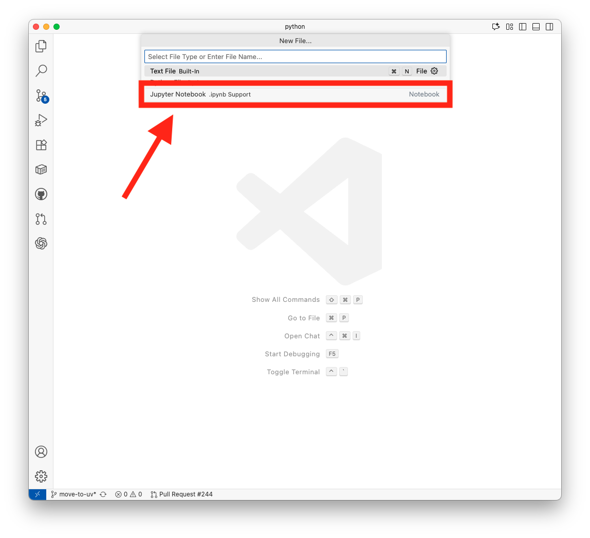
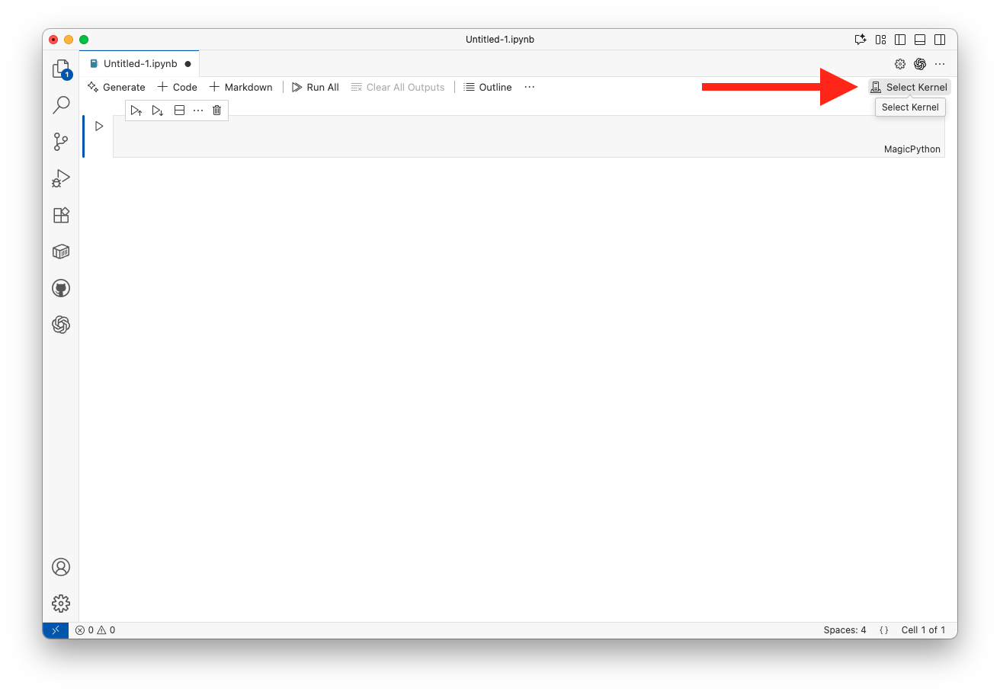
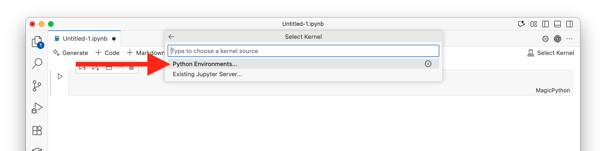
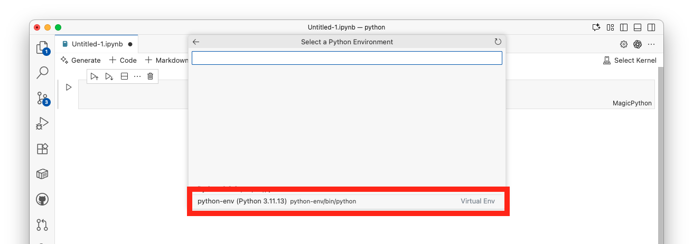
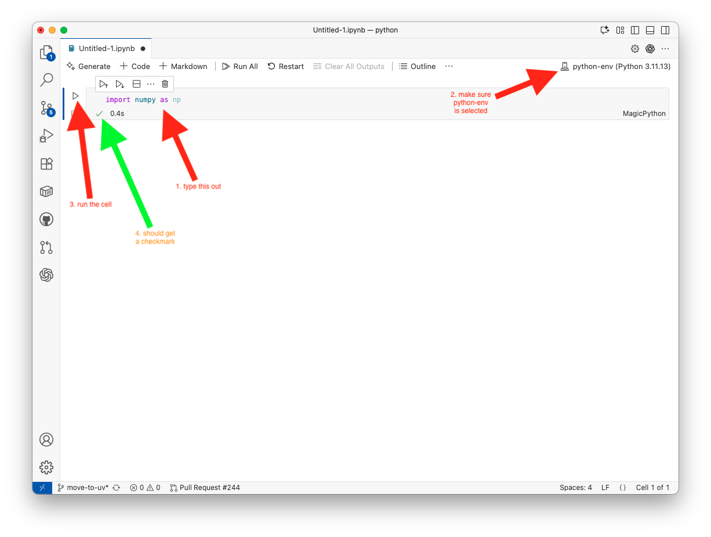

# Setup
## Environment Setup Guide
Before using this repo, make sure you’ve completed the [environment setup guide](https://github.com/UofT-DSI/onboarding/blob/main/environment_setup/README.md), which installs the core tools you’ll need for this module, such as:

- Git  
- Git Bash (for Windows)  
- Visual Studio Code
- UV

## Necessary Packages
The Python module uses its own isolated environment called `python-env` so that packages don’t conflict with other projects. 
We use **uv** to create this environment, activate it, and install the required packages listed in the module’s `pyproject.toml`.  
This setup only needs to be done **once per module**, after that, you just activate the environment whenever you want to work in this repo.  

Open a terminal (macOS/Linux) or Git Bash (Windows) in this repo, and run the following commands in order:

1. Create a virtual environment called `python-env`:
    ```
    uv venv python-env --python 3.11
    ```

2. Activate the environment:
    - for macOS/Linux:
        ```
        source python-env/bin/activate
        ```
        
    - for windows (git bash):    
        ```
        source python-env/Scripts/activate
        ```

3. Install all required packages from the [pyproject.toml](./pyproject.toml)
    ```bash
    uv sync --active
    ```

## Environment Usage
In order to run any code in this repo, you must first activate its environment.
- for macOS/Linux:
    ```
    source python-env/bin/activate
    ```
    
- for windows (git bash):    
    ```
    source python-env/Scripts/activate
    ```

When the environment is active, your terminal prompt will change to show:  
```
(python-env) $
```
This is your **visual cue** that you’re working inside the right environment.  

When you’re finished, you can deactivate it with:  
```bash
deactivate
```

> **👉 Remember**   
> Only one environment can be active at a time. If you switch to a different repo, first deactivate this one (or just close the terminal) and then activate the new repo’s environment.

## Connecting `python-env` to VS Code

### Step 1: Open VS Code:
Launch Visual Studio Code.

### Step 2: Create or Open a Notebook
1. Create a new notebook:
    - In the menu bar, click on the File button. From the dropdown list, click New File.
    - You can then type in Jupyter and select the Jupyter Notebook option.
    - The file should have an .ipynb extension (e.g., new_notebook.ipynb) when you save it.
2. Note that later on you will also be opening existing Jupyter Notebook files.


### Step 3: Select the Kernel
1. Look for the Kernel Picker in the top-right corner of the notebook interface in VS Code and click it. It will say something like Select Kernel if no kernel is currently selected.


> Note: If your notebook does not look like this or you do not see a Select Kernel button, you may not have the extension installed. Please ensure you have the Jupyter extension ([download and install here](https://marketplace.visualstudio.com/items?itemName=ms-toolsai.jupyter)).

2. Click on the Kernel Picker and click Python Environments, then choose the `python-env` kernel from the dropdown list.





### Step 4: Verify the Kernel

1. Once the kernel is connected, you should see the name `python-env` in the top-right corner of the notebook editor.
2. Test the kernel by typing import numpy as np into the "cell" (the box in the notebook) and clicking the run button (▶️) next to the cell. 



If no error messages come up then you are good to go!

---

For questions or issues, please contact the Python Module learning support team or email courses.dsi@utoronto.ca.